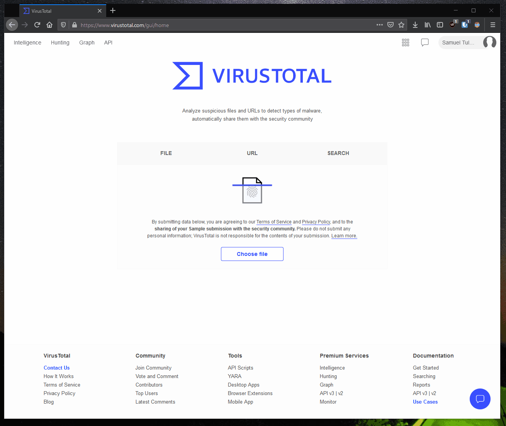
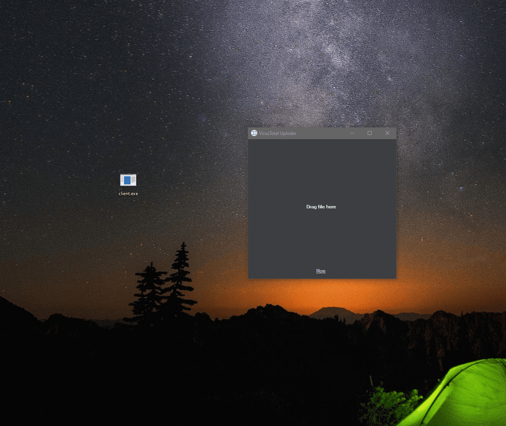

<h3 align="center">VirusTotal Uploader</h3>

Open-source desktop uploader for VirusTotal.

#### Warning
This is not officially supported application. It was created because official VirusTotal desktop app is unmaintained. If you are afraid, you can build it from source by yourself. Also please don't download it from any third-party sites.

#### Download ()
Please go to [releases page](https://github.com/SamuelTulach/VirusTotalUploader/releases) to download compiled app and installer. *Don't forget to star the repo!*

#### How to get API key
It is really simple! All you need to do is to go to [VirusTotal official page](https://www.virustotal.com/), create profile and copy your key.

#### How to use
It is really easy! Just drag and drop file into the app and voila!

#### Contributing
If you have any idea how to make this app better, please [create a pull request](https://github.com/SamuelTulach/VirusTotalUploader/compare). If you find any bug, please [create an issue](https://github.com/SamuelTulach/VirusTotalUploader/issues/new).

#### License
This project is licensed under GPLv3 and it's libraries under their license. Please check both [LICENSE.txt](LICENSE.txt) and [LICENSE_3rd.txt](LICENSE_3rd.txt).
